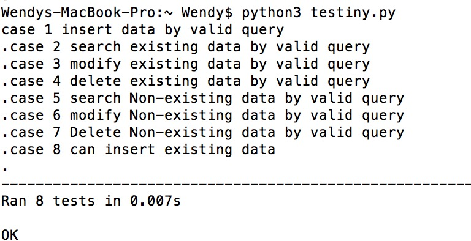

# Tinydb Test Final Report

**Author**: Xiqian Han, Yingyu Wu, Xu Han

**Email** : xhan5@kent.edu, ywu23@kent.edu, xhan9@kent.edu

## 1 Testing Strategy

### 1.1 Overall strategy

In order to test the Tinydb, our testing strategy will involve the system test. The system tests will be conducted as outlined in the “Test Cases” section below.

### 1.2 Test Selection

We will employ a black-box technique for the system tests (i.e., testing the functionality of the system without peering into the inner workings).

### 1.3 Test Criterion

System tests will be assessed by functional coverage, and it should cover most of the usercase with one or more system tests.

#### Funcational Test

1) Database connection

2) Query

3) Data type 

#### No-Functional Test

1) Speed. The system should be able to return the result in 3 seconds.

2) Convenient. It should be easier for user to interact with it.
  

## 2 Test Cases

| # | Test Name |   Expected Result | Actual Result | Pass/Fail |
|:-:|:----------|:----------------|:--------------|:---------:|
| 1 | Insert the data by Valid query | return the expect result | return the expect result | Pass |
| 2 | Search the data which is existing by Valid query | Data inserted | Data inserted | Pass |
| 3 | Modify the data which is existing by Valid query | Data modified | Data modified | Pass |
| 4 | Delete the data which is existing by Valid query | Data deleted | Data deleted | Pass |
| 5 | Search the data which is Not existing by Valid query | return nothing | return empty array | Pass |
| 6 | Modify the data which is Not existing by Valid query | return nothing | return None | Pass |
| 7 | Delete the data which is Not existing by Valid query | return nothing | return None | Pass |
| 8 | Insert repeat data | Data inserted | Data inserted | Pass |

## 3 Obversation
TinyDB is really tiny. We found it's structure is json. It's very easy to insert, search , edit and delete data. Exceptions like searching, updating, deleting non-existing data are handled. Very efficient for creating simple data structure and don't need to worry too much about datatype errors.

## 4 ScreenShot

